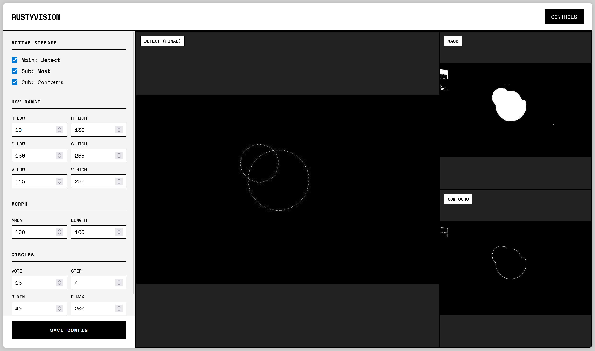

# RustyVision

A high-performance object detection vision system for FIRST Robotics Competition, written in Rust.

## Functionality
- Real-time object detection for FRC game pieces (2026 Rebuilt Fuel)
- Sub-50ms latency from camera to detected pieces (NT coming soon)
- Web-based configuration dashboard + live video streaming for driver station

## Next Steps
- Network tables integration
- Camera calibration
- Game-piece permanence
- Live robot detection
